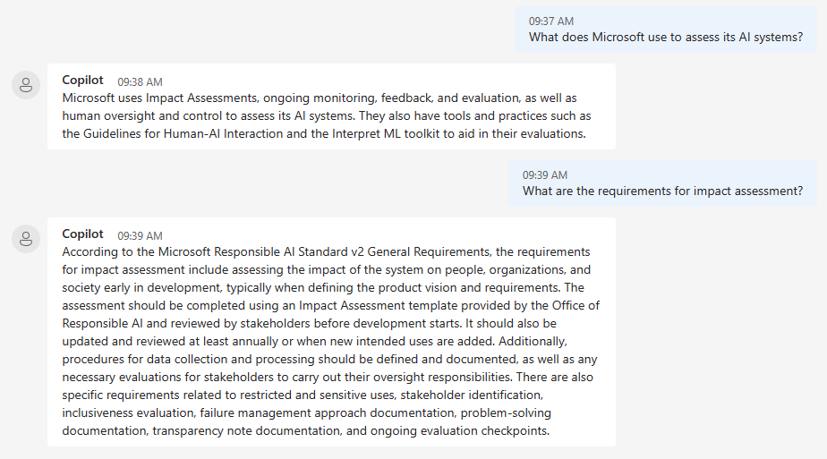

# Copilot Chat Import Document App

> **!IMPORTANT**
> This sample is for educational purposes only and is not recommended for production deployments.

One of the exciting features of the Copilot Chat App is its ability to store contextual information
to [memories](https://github.com/microsoft/semantic-kernel/blob/main/docs/EMBEDDINGS.md) and retrieve
relevant information from memories to provide more meaningful answers to users through out the conversations.

Memories can be generated from conversations as well as imported from external sources, such as documents.
Importing documents enables Copilot Chat to have up-to-date knowledge of specific contexts, such as enterprise and personal data.

## Configure your environment
1. (Optional when importing documents to the global collection) A registered App in Azure Portal (https://learn.microsoft.com/azure/active-directory/develop/quickstart-register-app)
   - Select Mobile and desktop applications as platform type, and the Redirect URI will be `http://localhost`
   - Select **`Accounts in any organizational directory (Any Azure AD directory - Multitenant)
     and personal Microsoft accounts (e.g. Skype, Xbox)`** as the supported account
     type for this sample.
   - Note the **`Application (client) ID`** from your app registration.
2. Make sure the service is running. To start the service, see [here](../webapi/README.md).

## Running the app
1. Ensure the web api is running at `https://localhost:40443/`.
2. Configure the appsettings.json file under this folder root with the following variables and fill
   in with your information, where
   `ClientId` is the GUID copied from the **Application (client) ID** from your app registration in the Azure Portal,
   `RedirectUri` is the Redirect URI also from the app registration in the Azure Portal, and
   `ServiceUri` is the address the web api is running at.

   > `ClientId` and `RedirectUri` are optional if you only want to import documents to the global collection.
3. Change directory to this folder root.
4. **Run** the following command to import a document to the app under the global document collection where
   all users will have access to:
   `dotnet run -- --file .\sample-docs\ms10k.txt`
   
   Or **Run** the following command to import a document to the app under a user isolated document collection where
   only the user who uploaded the document will have access to:
   `dotnet run -- --file .\sample-docs\ms10k.txt --user-collection`

   > Note that this will open a browser window for you to sign in to retrieve your user id. 

   > Currently only supports txt files. A sample file is provided under ./sample-docs.

   Importing may take some time to generate embeddings for each piece/chunk of a document.
5. Chat with the bot.

   Examples:

   With [ms10k.txt](./sample-docs/ms10k.txt):
   

   With [Microsoft Responsible AI Standard v2 General Requirements.pdf](./sample-docs/Microsoft-Responsible-AI-Standard-v2-General-Requirements.pdf):
   